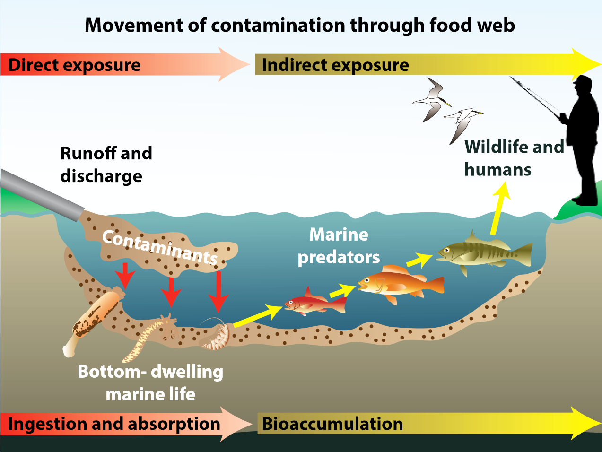
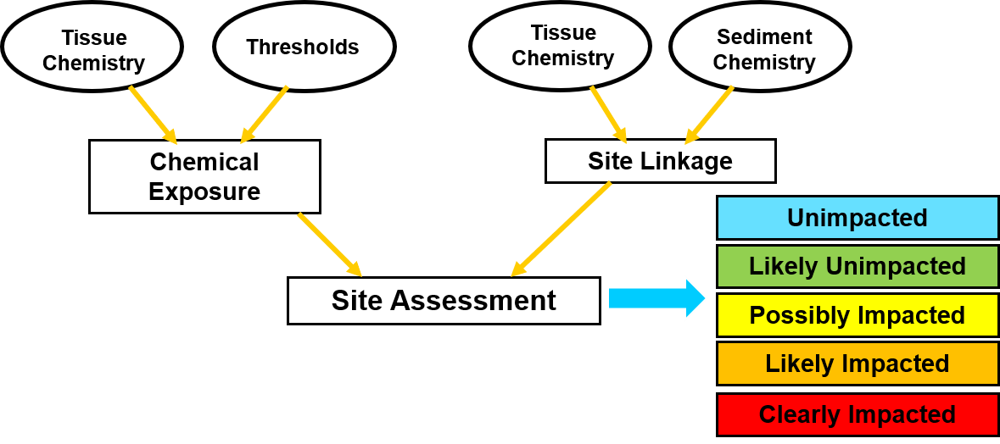
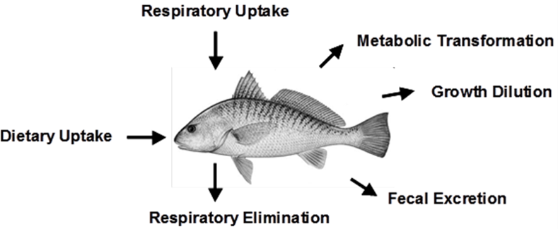
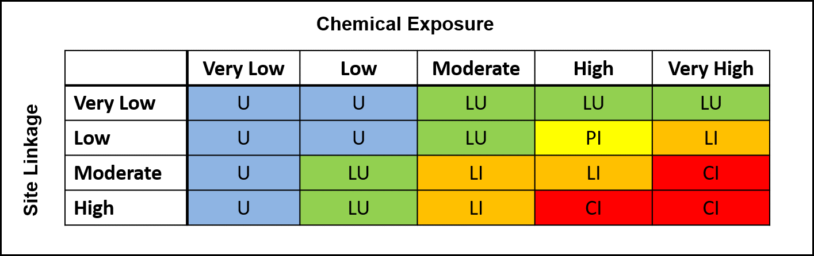

```{r setup, message = F, warning = F, echo = F}
library(knitr)
library(tidyverse)
library(shiny)
library(patchwork)
library(shinycssloaders)
library(SQObioaccumulation)
# devtools::load_all('../SQObioaccumulation/')

opts_chunk$set(warning = FALSE, message = FALSE, eval = T, echo = F)

source('R/funcs.R')

# rmd downloads
downloadButtonRmd <- function (outputId, label = "Download", class = NULL, ...)  {
  tags$a(id = outputId, class = paste("btn btn-default shiny-download-link", 
                                      class), href = "", target = "_blank", download = NA, 
         icon("download"), label, ...)
}
```

```{r data}
# data inputs, lookups
indic_lookup <- read.csv('data/indic_lookup.csv', stringsAsFactors = FALSE)

# data inputs, with empty values to fill with user input
biotaemp <- read.csv('data/biotaemp.csv', stringsAsFactors = FALSE)
constantsemp <- read.csv('data/constantsemp.csv', stringsAsFactors = FALSE)
contamemp <- read.csv('data/contamemp.csv', stringsAsFactors = FALSE)
mcsparmsemp <- read.csv('data/mcsparmsemp.csv', stringsAsFactors = F)

# indicator species lookup format for inputs
indic_lookup <- indic_lookup %>% 
  group_by(Indicator.number) %>% 
  nest %>% 
  deframe %>% 
  map(function(x) pull(x, Guild.species))
```

```{r}
# top controllers
column(12, 
  column(4, actionButton("run", "Run food web model and MCS!")),
  column(2, h6('Number of MC sims')), 
  column(2, numericInput('nsim', NULL, value = 1000, min = 1, max = 20000))
)
```
<br></br>

```{r reactives}
res <- reactiveValues(cbiota = NULL, bsaf = NULL, contamcalc = NULL)

# run bioaccumulation model with inputs
observeEvent(input$run, 
  withProgress(
    message='Please wait',
    detail='Running...',
    value = 0, 
    {
         
      # input
      upload <- as.logical(input$upload)
      
      # sanity checks if file upload true and no files uploaded on execute
      if(upload){
        
        # make sure all files are uploaded
        req(!is.null(input$biotaupl))
        req(!is.null(input$constantsupl))
        req(!is.null(input$contamupl))
        req(!is.null(input$mcsparmsupl))
      
      }

      # format biota from input
      biota <- formsppinp(input, biotaemp, upload)
    
      # format constants from input
      constants <- formcnsinp(input, constantsemp, upload)
      
      # format contams from input
      contam <- formcntinp(input, contamemp, upload)

      # calculated contaminant inputs
      contamcalc <- cntcalc(contam, constants)
    
      btch <- bioaccum_batch(biota, contamcalc, constants)
    
      # append to reactive output
      res$cbiota <- btch$cbiota
      res$bsaf <- btch$bsaf
      res$contamcalc <- contamcalc
  
    }
  )
)

# bsaf results
bsaf <- reactive({

  # input
  bsaf <- res$bsaf
  
  return(bsaf)
  
})

# concentration in biota
cbiota <- reactive({
  
  # input
  cbiota <- res$cbiota

  return(cbiota)
  
})

# summary of contaminants across indicator guilds
indic_sum <- reactive({

  # input
  cbiota <- cbiota()
  contamcalc <- res$contamcalc
  # upload <- input$upload
  
  req(!is.null(res$contamcalc))

  # if(upload)
  #   validate(
  #     need(
  #       !any(
  #         is.null(input$biotaupl),
  #         is.null(input$constantsupl),
  #         is.null(input$contamupl),
  #         is.null(input$mcsparmsupl)
  #         ),
  #       'Upload all files before running model'
  #     )
  #   )
  
  out <- indic_sum_fun(cbiota, contamcalc)
  
  return(out)
  
})

# plot of bsaf and cbiota for selected contam
plobsaf <- reactive({
  
  # input
  bsaf <- bsaf()
  cbiota <- cbiota()
  cntbsaf <- input$cntbsaf
 
  req(cntbsaf)
  
  p <- plo_bsaf(bsaf, cbiota, cntbsaf)
  
  return(p)  
  
})

# table of bsaf and cbiota for all contaminants
tabbsaf <- reactive({
  
  # input
  bsaf <- bsaf()
  cbiota <- cbiota()
 
  req(bsaf)
  
  totab <- tab_bsaf(bsaf, cbiota)
  
  return(totab)
  
})

# get weighted average observed tissue concentrations from input, by contaminant category
wgtavg <- eventReactive(input$run, {

  # input
  upload <- as.logical(input$upload)
  
  # format mcs inputs
  mcsparms <- formmcsinp(input, mcsparmsemp, upload)

  out <- wgt_avg_fun(mcsparms)

  return(out)
  
})

# run MCS to get site linkage values for nsim
MCSres <- eventReactive(input$run,
  withProgress(
    message='Please wait',
    detail='Running...',
    value = 0, 
    {    
      ##
      # inputs
      
      # number of sims
      nsim <- input$nsim
      upload <- as.logical(input$upload)
      
      # estimated tissue concentrations for site linkages
      indic_sum <- indic_sum()
    
      # format constants from input
      constants <- formcnsinp(input, constantsemp, upload)
      
      # format mcs inputs
      mcsparms <- formmcsinp(input, mcsparmsemp, upload)
    
      ##
      # calcs
      out <- mcs_fun(nsim, indic_sum, mcsparms, constants)
    
      return(out)

}))

# site linkage plot from mcsres
mcspl <- reactive({
  
  # input
  MCSres <- MCSres()
  
  # plot
  p <- mcs_plo(MCSres)
  
  return(p)

})

# all mcs results long format
mcsreslng <- reactive({
  
  # input
  MCSres <- MCSres()
  
  totab <- MCSres %>% 
    spread(contam, sitsedlnk) %>% 
    mutate_if(is.numeric, round, 2)
  
  return(totab)

})

# summarize MCres to get percentiles of site linkage values
MCSsum <- reactive({
  
  # inputs
  MCSres <- MCSres()
  
  out <- mcs_sum_fun(MCSres)
  
  return(out)
  
})

# SQO assessment summary
sqosum <- reactive({
  
  # inputs
  MCSres <- MCSres()
  wgtavg <- wgtavg()
  
  out <- sqo_sum_fun(wgtavg, MCSres, constants)
  
  return(out)
  
})
```

```{r downloadhandlers}
# dl summary of contaminants across indicator guilds
output$dlindicsum <- downloadHandler(
  filename = function(){paste0(input$flprf, '_indicsum.csv')},
  content = function(file){
    write.csv(indic_sum(), file, quote = T, row.names = F)
  }
)

# dl plot for bsaf and cbiota for contaminant
output$dlplobsaf <- downloadHandler(
  filename = function(){paste0(input$flprf, '_', input$cntbsaf, '_plot.png')},
  content = function(file){
    png(file, width = 9, height = 7, family = 'serif', units = 'in', res = 250)
    print(plobsaf())
    dev.off()
  }
)

# dl table for bsaf and cbiota for all contaminants
output$dltabbsaf <- downloadHandler(
  filename = function(){paste0(input$flprf, '_allests.csv')},
  content = function(file){
    write.csv(tabbsaf(), file, quote = T, row.names = F)
  }
)

# dl table for sqo summary
output$dlsqosum <- downloadHandler(
  filename = function(){paste0(input$flprf, '_sqosum.csv')},
  content = function(file){
    write.csv(sqosum(), file, quote = T, row.names = F)
  }
)

# dl table for mcs summary
output$dlmcssum <- downloadHandler(
  filename = function(){paste0(input$flprf, '_mcssum.csv')},
  content = function(file){
    write.csv(MCSsum(), file, quote = T, row.names = F)
  }
)

# dl plot for mcs summary
output$dlmcspl <- downloadHandler(
  filename = function(){paste0(input$flprf, '_mcsplot.png')},
  content = function(file){
    png(file, width = 9, height = 7, family = 'serif', units = 'in', res = 250)
    print(mcspl())
    dev.off()
  }
)

# dl table for all mcs results
output$dlmcsreslng <- downloadHandler(
  filename = function(){paste0(input$flprf, '_mcsresults.csv')},
  content = function(file){
    write.csv(mcsreslng(), file, quote = T, row.names = F)
  }
)

# dl table for all calculated contaminants
output$dlcalccont <- downloadHandler(
  filename = function(){paste0(input$flprf, '_calccont.csv')},
  content = function(file){
    write.csv(res$contamcalc, file, quote = T, row.names = F)
  }
)

# dl biota template
output$dlbiotatmpl <- downloadHandler(
  filename = function(){'biota_User.csv'},
  content = function(file){
    fl <- read.csv('data/inptmp/biota_User.csv', stringsAsFactors = F)
    write.csv(fl, file, quote = T, row.names = F)
  }
)

# dl constants template
output$dlconstantstmpl <- downloadHandler(
  filename = function(){'constants_User.csv'},
  content = function(file){
    fl <- read.csv('data/inptmp/constants_User.csv', stringsAsFactors = F)
    write.csv(fl, file, quote = T, row.names = F)
  }
)

# dl contam template
output$dlcontamtmpl <- downloadHandler(
  filename = function(){'contam_User.csv'},
  content = function(file){
    fl <- read.csv('data/inptmp/contam_User.csv', stringsAsFactors = F)
    write.csv(fl, file, quote = T, row.names = F)
  }
)

# dl mcsparms template
output$dlmcsparmstmpl <- downloadHandler(
  filename = function(){'mcsparms_User.csv'},
  content = function(file){
    fl <- read.csv('data/inptmp/mcsparms_User.csv', stringsAsFactors = F)
    write.csv(fl, file, quote = T, row.names = F)
  }
)

```

# {.tabset}

## Overview {.tabset .tabset-pills}

### Background 

This tool applies an assessment framework for evaluating the effects of sediment contaminants in enclosed bays and estuaries on human health. This framework was developed to assist the State Water Resources Control Board in implementing California’s narrative Sediment Quality Objective for human health (HHSQO) that states: Pollutants shall not be present in sediments at levels that will bioaccumulate in aquatic life to levels that are harmful to human health. 

This objective focuses on the pathway of humans consuming seafood (fish or shellfish) that have accumulated contaminants from the sediment. The intent of this framework is to provide a standardized assessment approach for application to a variety of regulatory and monitoring programs. The assessment framework was adopted by the Water Board in 2018 and received final approval by the EPA in 2019. 

Information for programmatic application of the framework is included in the <a href="https://www.waterboards.ca.gov/water_issues/programs/bptcp/docs/sediment/sed_qual_provs.pdf" target="_blank">Water Quality Control Plan</a> for Enclosed Bays and Estuaries of California. A description of the development and conceptual approach for the framework can be found in <a href="http://ftp.sccwrp.org/pub/download/DOCUMENTS/TechnicalReports/1000_SQOHumanHealthFramework.pdf" target="_blank">SCCWRP Technical Report 1000</a>. The technical tools developed for the framework are currently applicable only for legacy organochlorine compounds: PCBs, DDTs, chlordanes, and dieldrin. This assessment tool applies the standardized Tier 2 assessment described in the Water Quality Control Plan.

```{r infograph, out.width = "60%", fig.align = 'center', fig.cap = "Conceptualized pathway of the movement of contaminants through the food web."}

```

### Approach

The HHSQO assessment framework was developed based on a general conceptual model of sediment-associated contaminant exposure to humans, through the pathway of food web trophic transfer. In this conceptual model, contaminants in sediment and the water column transfer through a food web which includes invertebrates and finfish. Humans are then exposed to these contaminants when they consume the invertebrates or finfish. The assessment framework addresses food web bioaccumulation of contaminants using a mechanistic model of contaminant trophic transfer. To address the complexity of bioaccumulation in food webs, the framework includes nine fish dietary guilds to address variation in diets of commonly consumed fish. The bioaccumulation model uses a separate food web for each fish dietary guild.

The conceptual model focuses on the sediment as a potential route of exposure to biota, rather than other potential routes, such as watershed loading, atmospheric deposition, or discharges from upstream water bodies. 

Evaluation of HHSQO involves two assessment questions:

* Do pollutant concentrations in seafood pose unacceptable health risks to human consumers?  
* Is sediment contamination at a site a significant contributor to the seafood contamination?

```{r assesscat, out.width = "75%", fig.align = 'center'}

```

These questions are evaluated using two indicators: Chemical Exposure and Site Linkage. For the chemical exposure indicator, seafood contamination measurements from the site are compared to thresholds based on OEHHA fish consumption advisory levels designed to protect human health. For the site linkage indicator, the seafood contamination measurements are compared to estimated seafood concentrations that would result from local site exposure. Estimated seafood concentrations are calculated using a steady state bioaccumulation model adapted from that developed for San Francisco Bay by <a href="https://doi.org/10.1002/etc.164" target="_blank"> Gobas and Arnot (2010)</a>.

The outcome of the assessment is a categorical site impact assessment determined by the integration of the Chemical Exposure and Site Linkage results. Sites classified as Unimpacted or Likely Unimpacted meet the HHSQO.

### Assessment Steps

Using the HHSQO assessment tool includes four steps, which must be followed in sequence:

* Step 1: Input data for site-specific parameters, fish characteristics, and chemical concentration of sediment and tissue.
* Step 2: Run the bioaccumulation model to calculate bioaccumulation factors and estimated tissue concentration for use in site linkage calculations.
* Step 3: Perform Monte Carlo Simulations (MCS) to generate cumulative probability distributions of site linkage results.
* Step 4: Review the SQO assessment results

### Attribution

The assessment framework conceptual approach and methods were developed by Steven M. Bay, Ben K. Greenfield, Aroon R. Melwani, and Ashley N. Parks, with review and input from members of the SQO Scientific Steering Committee, Sediment Quality Advisory Committee, and SCCWRP staff. The bioaccumulation model core functions were adapted by Marcus Beck from code written by Michelle Lent in 2010 and edited by Ben Greenfield and Michelle Lent. This work was supported by the State Water Resources Control Board.

All site content by [Marcus Beck](mailto:marcusb@sccwrp.org) and [Steven Bay](steveb@sccwrp.org)

```{r logo, out.width = "15%", fig.align = 'left'}

```

## Model inputs {.tabset .tabset-pills}

### Description

Six types of site-specific data are required for the assessment:

* Number of Monte Carlo simulations
* Download file prefix
*	Indicator guild species lipid content (biota.csv)
*	Site and environmental data, including site dimensions, water and sediment organic content, and water quality characteristics (constants.csv)
*	Sediment contaminants, including measured values of each chemical constituent in sediment and water column (contam.csv); pore water concentrations optional
*	MCS parameters, including diet proportion and tissue concentration for selected fish indicator species, and sediment concentration for each contaminant group (mcsparms.csv)

Data can be either uploaded as csv files (recommended) or manually entered using a computer keyboard. Be sure to specify the number of MCS simulations used in the analysis (min 1,000 for exploratory analyses; 10,000 for regulatory application). 

The tool results may be saved as a downloaded file. A user-determined file prefix should be entered, which will be included in the title of the download files. 

Run the food web model once data input is complete. The model must be rerun each time any of the input data have been changed.

#### Entry Notes 

* `biota.csv` <br> The tissue lipid content of each of up to nine indicator species should be entered as kg/kg wet weight, which may need conversion from commonly reported percent data (eg., 2% lipid = 0.02 kg/kg). Fish species data are identified by indicator number (e.g., indic1, indic2, etc). Only lipid data for fish indicators having contaminant data should be entered; leave cell blank for unused species. Required indicator species list for regulatory application: indic1=California halibut; indic2=spotted sand bass; indic3=queenfish; indic4=white croaker; indic5=shiner perch; indic6=common carp; indic7=topsmelt; indic8=striped mullet; indic9=white catfish.  Additional information on the fish guilds is available in SCCWRP Technical Report 1000.
     
*	`constants.csv` <br> A numeric value must be provided for each data type in the file. If a site-specific value is not available, then a default value, such as that included in the data file template, should be used. Measurement units must be the same as those specified in the csv file notes.

*	`contam.csv` <br> This file lists each individual component of each of four chemical groups: chlordanes, dieldrin, DDTs, and PCBs. Average sediment and dissolved water column concentrations representative of the site are required and should be entered into columns cs_ng.g and cd_ng.g, respectively. If data are not available for some components (e.g., specific PCB congeners), then leave the cell blank. The tool will calculate dissolved chemical concentrations for the water column and pore water if the data are not present. Units must be ng/g dry weight for sediment and pg/L for water.

* `mcsparms.csv` <br> This file contains three types of data needed to perform the MCS routine: proportion of the seafood diet represented by each fish type (propseaf), mean and SE of tissue concentration for each chemical group by indicator number, and mean and SE of sediment concentration for chemical group. Leave the cell blank if data are not available. <br><br> The "propseaf" value indicates the proportion (ranging from 0 to 1) of the human diet represented by a given indicator species. Note that the propseaf values for all indicator species must sum to exactly 1 for the analysis to run correctly. A default assumption of approximately equal proportions should be used unless site-specific data is available. For example, using three indicators: indic1propseaf=0.33; indic3propseaf=0.33; indic5propseaf=0.34. <br><br> Tissue contaminant data should be the mean and standard error of at least three measurements and entered in units of ng/g wet wt. Enter a value of zero (0) if the SE is not available. <br><br> Sediment contaminant data should be the mean and standard error of at least three measurements and entered in units of ng/g dry wt. Enter a value of zero (0) if the SE is not available.

### Inputs

```{r}
column(12,
  column(3, selectInput('upload', label = 'Select input type:', choices = list('Manual entry' = FALSE, 'File upload' = TRUE), selected = TRUE)),
  column(3, textInput('flprf', 'File prefix for downloads:', value = 'output1'))
)         
```

```{r}
output$entry <- renderUI({
  
  # inputs
  upload <- as.logical(input$upload)

  if(!upload){
    
    # splitlayout widths
    wds <- 100

    w1 <- wellPanel(id = "indicspec", style = "overflow-x:scroll; background-color:#daf1da",
    
      # headers 1
      fluidRow(
        column(3, renderText(NULL)),
        column(3, renderText(NULL)),
        column(2, renderText(NULL)),
        splitLayout(cellWidths = wds,
          renderText(NULL),
          h6('Chlordane (ng/g)'),
          renderText(NULL),
          h6('Dieldrin (ng/g)'),
          renderText(NULL),
          h6('DDT (ng/g)'),
          renderText(NULL),
          h6('PCB (ng/g)'),
          renderText(NULL)
        )
      ),

      # headers 2
      fluidRow(
        column(3, renderText(NULL)),
        column(3, h6('Select species')),
        column(2, h6('Portion seafood')),
        splitLayout(cellWidths = wds,
          h6('Lipid proportion'),
          h6('Mean'),
          h6('SE'),
          h6('Mean'),
          h6('SE'),
          h6('Mean'),
          h6('SE'),
          h6('Mean'),
          h6('SE')
        )
      ),

      # indic 1
      fluidRow(
        column(3, h6('1 Piscivore')),
        column(3, selectInput('indic1', NULL, choices = indic_lookup[['Indicator species 1']], selected = indic_lookup[['Indicator species 1']][1])
               ),
        column(2, numericInput('indic1propseaf', NULL, value = 0, min = 0, max = 1)),
        splitLayout(cellWidths = wds,
          numericInput('indic1lip', NULL, value = 0.0036, min = 0, max = 1, width = '100%'),
          numericInput('indic1ChlordaneX', NULL, value = NULL, min = 0, width = '100%'),
          numericInput('indic1ChlordaneSD', NULL, value = NULL, min = 0, width = '100%'),
          numericInput('indic1DieldrinX', NULL, value = NULL, min = 0, width = '100%'),
          numericInput('indic1DieldrinSD', NULL, value = NULL, min = 0, width = '100%'),
          numericInput('indic1DDTX', NULL, value = NULL, min = 0, width = '100%'),
          numericInput('indic1DDTSD', NULL, value = NULL, min = 0, width = '100%'),
          numericInput('indic1PCBX', NULL, value = NULL, min = 0, width = '100%'),
          numericInput('indic1PCBSD', NULL, value = NULL, min = 0, width = '100%')
        )
      ),

      # indic 2
      fluidRow(
        column(3, h6('2 Benthic diet with piscivory')),
        column(3, selectInput('indic2', NULL, choices = indic_lookup[['Indicator species 2']], selected = indic_lookup[['Indicator species 2']][14])),
        column(2, numericInput('indic2propseaf', NULL, value = 0.5, min = 0, max = 1)),
        splitLayout(cellWidths = wds,
          numericInput('indic2lip', NULL, value = 0.0069, min = 0, max = 1, width = '100%'),
          numericInput('indic2ChlordaneX', NULL, value = 2.0425, min = 0, width = '100%'),
          numericInput('indic2ChlordaneSD', NULL, value = 0.909979488352973, min = 0, width = '100%'),
          numericInput('indic2DieldrinX', NULL, value = 0.25, min = 0, width = '100%'),
          numericInput('indic2DieldrinSD', NULL, value = 0, min = 0, width = '100%'),
          numericInput('indic2DDTX', NULL, value = 2.40733333333333, min = 0, width = '100%'),
          numericInput('indic2DDTSD', NULL, value = 1.30059647460184, min = 0, width = '100%'),
          numericInput('indic2PCBX', NULL, value = 71.0791428571429, min = 0, width = '100%'),
          numericInput('indic2PCBSD', NULL, value = 36.3098108973698, min = 0, width = '100%')
        )
      ),

      # indic 3
      fluidRow(
        column(3, h6('3 Benthic and pelagic with piscivory')),
        column(3, selectInput('indic3', NULL, choices = indic_lookup[['Indicator species 3']], selected = indic_lookup[['Indicator species 3']][6])),
        column(2, numericInput('indic3propseaf', NULL, value = 0, min = 0, max = 1)),
        splitLayout(cellWidths = wds,
          numericInput('indic3lip', NULL, value = 0.0158, min = 0, max = 1, width = '100%'),
          numericInput('indic3ChlordaneX', NULL, value = NULL, min = 0, width = '100%'),
          numericInput('indic3ChlordaneSD', NULL, value = NULL, min = 0, width = '100%'),
          numericInput('indic3DieldrinX', NULL, value = NULL, min = 0, width = '100%'),
          numericInput('indic3DieldrinSD', NULL, value = NULL, min = 0, width = '100%'),
          numericInput('indic3DDTX', NULL, value = NULL, min = 0, width = '100%'),
          numericInput('indic3DDTSD', NULL, value = NULL, min = 0, width = '100%'),
          numericInput('indic3PCBX', NULL, value = NULL, min = 0, width = '100%'),
          numericInput('indic3PCBSD', NULL, value = NULL, min = 0, width = '100%')
        )
      ),

      # indic 4
      fluidRow(
        column(3, h6('4 Benthic without piscivory')),
        column(3, selectInput('indic4', NULL, choices = indic_lookup[['Indicator species 4']], selected = indic_lookup[['Indicator species 4']][10])),
        column(2, numericInput('indic4propseaf', NULL, value = 0, min = 0, max = 1)),
        splitLayout(cellWidths = wds,
          numericInput('indic4lip', NULL, value = 0.0329, min = 0, max = 1, width = '100%'),
          numericInput('indic4ChlordaneX', NULL, value = NULL, min = 0, width = '100%'),
          numericInput('indic4ChlordaneSD', NULL, value = NULL, min = 0, width = '100%'),
          numericInput('indic4DieldrinX', NULL, value = NULL, min = 0, width = '100%'),
          numericInput('indic4DieldrinSD', NULL, value = NULL, min = 0, width = '100%'),
          numericInput('indic4DDTX', NULL, value = NULL, min = 0, width = '100%'),
          numericInput('indic4DDTSD', NULL, value = NULL, min = 0, width = '100%'),
          numericInput('indic4PCBX', NULL, value = NULL, min = 0, width = '100%'),
          numericInput('indic4PCBSD', NULL, value = NULL, min = 0, width = '100%')
        )
      ),

      # indic 5
      fluidRow(
        column(3, h6('5 Benthic and pelagic without piscivory')),
        column(3, selectInput('indic5', NULL, choices = indic_lookup[['Indicator species 5']], selected = indic_lookup[['Indicator species 5']][4])),
        column(2, numericInput('indic5propseaf', NULL, value = 0.5, min = 0, max = 1)),
        splitLayout(cellWidths = wds,
          numericInput('indic5lip', NULL, value = 0.0109, min = 0, max = 1, width = '100%'),
          numericInput('indic5ChlordaneX', NULL, value = 2.5275, min = 0, width = '100%'),
          numericInput('indic5ChlordaneSD', NULL, value = 0.4157433102288, min = 0, width = '100%'),
          numericInput('indic5DieldrinX', NULL, value = 0.25, min = 0, width = '100%'),
          numericInput('indic5DieldrinSD', NULL, value = 0, min = 0, width = '100%'),
          numericInput('indic5DDTX', NULL, value = 7.283, min = 0, width = '100%'),
          numericInput('indic5DDTSD', NULL, value = 2.51069636948402, min = 0, width = '100%'),
          numericInput('indic5PCBX', NULL, value = 1.9195, min = 0, width = '100%'),
          numericInput('indic5PCBSD', NULL, value = 0.976160911428029, min = 0, width = '100%')
        )
      ),

      # indic 6
      fluidRow(
        column(3, h6('6 Benthic with herbivory')),
        column(3, selectInput('indic6', NULL, choices = indic_lookup[['Indicator species 6']], selected = indic_lookup[['Indicator species 6']][1])),
        column(2, numericInput('indic6propseaf', NULL, value = 0, min = 0, max = 1)),
        splitLayout(cellWidths = wds,
          numericInput('indic6lip', NULL, value = 0.0356, min = 0, max = 1, width = '100%'),
          numericInput('indic6ChlordaneX', NULL, value = NULL, min = 0, width = '100%'),
          numericInput('indic6ChlordaneSD', NULL, value = NULL, min = 0, width = '100%'),
          numericInput('indic6DieldrinX', NULL, value = NULL, min = 0, width = '100%'),
          numericInput('indic6DieldrinSD', NULL, value = NULL, min = 0, width = '100%'),
          numericInput('indic6DDTX', NULL, value = NULL, min = 0, width = '100%'),
          numericInput('indic6DDTSD', NULL, value = NULL, min = 0, width = '100%'),
          numericInput('indic6PCBX', NULL, value = NULL, min = 0, width = '100%'),
          numericInput('indic6PCBSD', NULL, value = NULL, min = 0, width = '100%')
        )
      ),

      # indic 7
      fluidRow(
        column(3, h6('7 Benthic and pelagic with herbivory')),
        column(3, selectInput('indic7', NULL, choices = indic_lookup[['Indicator species 7']], selected = indic_lookup[['Indicator species 7']][2])),
        column(2, numericInput('indic7propseaf', NULL, value = 0, min = 0, max = 1)),
        splitLayout(cellWidths = wds,
          numericInput('indic7lip', NULL, value = 0.0117, min = 0, max = 1, width = '100%'),
          numericInput('indic7ChlordaneX', NULL, value = NULL, min = 0, width = '100%'),
          numericInput('indic7ChlordaneSD', NULL, value = NULL, min = 0, width = '100%'),
          numericInput('indic7DieldrinX', NULL, value = NULL, min = 0, width = '100%'),
          numericInput('indic7DieldrinSD', NULL, value = NULL, min = 0, width = '100%'),
          numericInput('indic7DDTX', NULL, value = NULL, min = 0, width = '100%'),
          numericInput('indic7DDTSD', NULL, value = NULL, min = 0, width = '100%'),
          numericInput('indic7PCBX', NULL, value = NULL, min = 0, width = '100%'),
          numericInput('indic7PCBSD', NULL, value = NULL, min = 0, width = '100%')
        )
      ),

      # indic 8
      fluidRow(
        column(3, h6('8 Pelagic with benthic herbivory')),
        column(3, selectInput('indic8', NULL, choices = indic_lookup[['Indicator species 8']], selected = indic_lookup[['Indicator species 8']][2])),
        column(2, numericInput('indic8propseaf', NULL, value = 0, min = 0, max = 1)),
        splitLayout(cellWidths = wds,
          numericInput('indic8lip', NULL, value = 0.0444, min = 0, max = 1, width = '100%'),
          numericInput('indic8ChlordaneX', NULL, value = NULL, min = 0, width = '100%'),
          numericInput('indic8ChlordaneSD', NULL, value = NULL, min = 0, width = '100%'),
          numericInput('indic8DieldrinX', NULL, value = NULL, min = 0, width = '100%'),
          numericInput('indic8DieldrinSD', NULL, value = NULL, min = 0, width = '100%'),
          numericInput('indic8DDTX', NULL, value = NULL, min = 0, width = '100%'),
          numericInput('indic8DDTSD', NULL, value = NULL, min = 0, width = '100%'),
          numericInput('indic8PCBX', NULL, value = NULL, min = 0, width = '100%'),
          numericInput('indic8PCBSD', NULL, value = NULL, min = 0, width = '100%')
        )
      ),

      # indic 9
      fluidRow(
        column(3, h6('9 Benthic diet with piscivory: estuarine')),
        column(3, selectInput('indic9', NULL, choices = indic_lookup[['Indicator species 9']], selected = indic_lookup[['Indicator species 9']][1])),
        column(2, numericInput('indic9propseaf', NULL, value = 0, min = 0, max = 1)),
        splitLayout(cellWidths = wds,
          numericInput('indic9lip', NULL, value = 0.0036, min = 0, max = 1, width = '100%'),
          numericInput('indic9ChlordaneX', NULL, value = NULL, min = 0, width = '100%'),
          numericInput('indic9ChlordaneSD', NULL, value = NULL, min = 0, width = '100%'),
          numericInput('indic9DieldrinX', NULL, value = NULL, min = 0, width = '100%'),
          numericInput('indic9DieldrinSD', NULL, value = NULL, min = 0, width = '100%'),
          numericInput('indic9DDTX', NULL, value = NULL, min = 0, width = '100%'),
          numericInput('indic9DDTSD', NULL, value = NULL, min = 0, width = '100%'),
          numericInput('indic9PCBX', NULL, value = NULL, min = 0, width = '100%'),
          numericInput('indic9PCBSD', NULL, value = NULL, min = 0, width = '100%')
        )
      ),

      # sediment contaminant concentration
      fluidRow(
        column(6, h5('Sediment contaminant concentration')),
        # column(3, NULL),
        column(2, NULL),
        splitLayout(cellWidths = wds,
          renderText(NULL),
          numericInput('sedChlordaneX', NULL, value = 0.5, min = 0, width = '100%'),
          numericInput('sedChlordaneSD', NULL, value = 0, min = 0, width = '100%'),
          numericInput('sedDieldrinX', NULL, value = 0.5, min = 0, width = '100%'),
          numericInput('sedDieldrinSD', NULL, value = 0, min = 0, width = '100%'),
          numericInput('sedDDTX', NULL, value = 1.19166666666667, min = 0, width = '100%'),
          numericInput('sedDDTSD', NULL, value = 0.765187658537288, min = 0, width = '100%'),
          numericInput('sedPCBX', NULL, value = 1.33454545454546, min = 0, width = '100%'),
          numericInput('sedPCBSD', NULL, value = 1.60216108332035, min = 0, width = '100%')
        )
      )
      
    )

    w2 <- wellPanel(id = "envdat", style = "background-color:#daf1da",

      # site area
      fluidRow(
        column(4, h6('Area of site (km2)')),
        column(2, numericInput('SA', NULL, value = 8.06, min = 0, width = '100%'))
      ),

      # site length
      fluidRow(
        column(4, h6('Length of site (km)')),
        column(2, numericInput('SL', NULL, value = 6, min = 0, width = '100%'))
      ),

      # organic carb prop in sed (TOC)
      fluidRow(
        column(4, h6('Organic carbon in sediment (kg/kg)')),
        column(2, numericInput('ocsed', NULL, value = 0.0163, width = '100%'))
      ),

      # doc conc in water
      fluidRow(
        column(4, h6('DOC conc. in water (kg/L)')),
        column(2, numericInput('xdoc', NULL, value = 0.00000215, min = 0, width = '100%'))
      ),

      # poc conc in water
      fluidRow(
        column(4, h6('POC conc. in water (kg/L)')),
        column(2, numericInput('xpoc', NULL, value = 0.00000157, min = 0, width = '100%'))
      ),

      # water temp
      fluidRow(
        column(4, HTML('<h6>Mean water temperature (&deg;C)</h6>')),
        column(2, numericInput('T', NULL, value = 17.4, width = '100%'))
      ),

      # salinity
      fluidRow(
        column(4, h6('Water salinity (psu)')),
        column(2, numericInput('salinity', NULL, value = 25.4, min = 0, width = '100%'))
      ),

      # dissolved oxygen
      fluidRow(
        column(4, h6('Dissolved oxygen (mg/L)')),
        column(2, numericInput('Cox', NULL, value = 8.09, min = 0, width = '100%'))
      ),

      # concentration of suspended solids
      fluidRow(
        column(4, h6('Conc. of suspended solids (kg/L)')),
        column(2, numericInput('vss', NULL, value = 0.0000246, min = 0, width = '100%'))
      )

    )
    
    w3 <- wellPanel(id = "contamdat", style = "overflow-y:scroll; max-height: 300px; background-color:#daf1da",

      # headers
      fluidRow(
        column(2, NULL),
        column(2, NULL),
        column(2, 'Sediment (ng/g dry wt)'),
        column(2, 'Dissolved surface water (pg/L)'),
        column(2, 'Pore water (pg/L)')
      ),

      # Chlordane
      fluidRow(
      	column(2, h6('Chlordane')),
      	column(2, h6('alphaChlordane')),
      	column(2, numericInput('alphaChlordane_sed', NULL, value = 0.5, min = 0, width = '100%')),
      	column(2, numericInput('alphaChlordane_dis', NULL, value = NULL, min = 0, width = '100%')),
      	column(2, numericInput('alphaChlordane_por', NULL, value = NULL, min = 0, width = '100%'))
      	),

      # Chlordane
      fluidRow(
      	column(2, h6('Chlordane')),
      	column(2, h6('gammaChlordane')),
      	column(2, numericInput('gammaChlordane_sed', NULL, value = 0.5, min = 0, width = '100%')),
      	column(2, numericInput('gammaChlordane_dis', NULL, value = NULL, min = 0, width = '100%')),
      	column(2, numericInput('gammaChlordane_por', NULL, value = NULL, min = 0, width = '100%'))
      	),

      # Chlordane
      fluidRow(
      	column(2, h6('Chlordane')),
      	column(2, h6('alphaNonachlor')),
      	column(2, numericInput('alphaNonachlor_sed', NULL, value = 0.49, min = 0, width = '100%')),
      	column(2, numericInput('alphaNonachlor_dis', NULL, value = NULL, min = 0, width = '100%')),
      	column(2, numericInput('alphaNonachlor_por', NULL, value = NULL, min = 0, width = '100%'))
      	),

      # Chlordane
      fluidRow(
      	column(2, h6('Chlordane')),
      	column(2, h6('gammaNonachlor')),
      	column(2, numericInput('gammaNonachlor_sed', NULL, value = 0.5, min = 0, width = '100%')),
      	column(2, numericInput('gammaNonachlor_dis', NULL, value = NULL, min = 0, width = '100%')),
      	column(2, numericInput('gammaNonachlor_por', NULL, value = NULL, min = 0, width = '100%'))
      	),

      # Chlordane
      fluidRow(
      	column(2, h6('Chlordane')),
      	column(2, h6('Oxychlordane')),
      	column(2, numericInput('Oxychlordane_sed', NULL, value = 0.23, min = 0, width = '100%')),
      	column(2, numericInput('Oxychlordane_dis', NULL, value = NULL, min = 0, width = '100%')),
      	column(2, numericInput('Oxychlordane_por', NULL, value = NULL, min = 0, width = '100%'))
      	),

      # Dieldrin
      fluidRow(
      	column(2, h6('Dieldrin')),
      	column(2, h6('Dieldrin')),
      	column(2, numericInput('Dieldrin_sed', NULL, value = 0.5, min = 0, width = '100%')),
      	column(2, numericInput('Dieldrin_dis', NULL, value = NULL, min = 0, width = '100%')),
      	column(2, numericInput('Dieldrin_por', NULL, value = NULL, min = 0, width = '100%'))
      	),

      # DDT
      fluidRow(
      	column(2, h6('DDT')),
      	column(2, h6('op-DDD')),
      	column(2, numericInput('op-DDD_sed', NULL, value = 0.189302326, min = 0, width = '100%')),
      	column(2, numericInput('op-DDD_dis', NULL, value = 9.305665792, min = 0, width = '100%')),
      	column(2, numericInput('op-DDD_por', NULL, value = NULL, min = 0, width = '100%'))
      	),

      # DDT
      fluidRow(
      	column(2, h6('DDT')),
      	column(2, h6('op-DDE')),
      	column(2, numericInput('op-DDE_sed', NULL, value = 6.704795349, min = 0, width = '100%')),
      	column(2, numericInput('op-DDE_dis', NULL, value = 44.88585023, min = 0, width = '100%')),
      	column(2, numericInput('op-DDE_por', NULL, value = 63.87, min = 0, width = '100%'))
      	),

      # DDT
      fluidRow(
      	column(2, h6('DDT')),
      	column(2, h6('op-DDT')),
      	column(2, numericInput('op-DDT_sed', NULL, value = 1.2, min = 0, width = '100%')),
      	column(2, numericInput('op-DDT_dis', NULL, value = NULL, min = 0, width = '100%')),
      	column(2, numericInput('op-DDT_por', NULL, value = 15.68, min = 0, width = '100%'))
      	),

      # DDT
      fluidRow(
      	column(2, h6('DDT')),
      	column(2, h6('pp-DDD')),
      	column(2, numericInput('pp-DDD_sed', NULL, value = 3.243651395, min = 0, width = '100%')),
      	column(2, numericInput('pp-DDD_dis', NULL, value = 19.45333669, min = 0, width = '100%')),
      	column(2, numericInput('pp-DDD_por', NULL, value = NULL, min = 0, width = '100%'))
      	),

      # DDT
      fluidRow(
      	column(2, h6('DDT')),
      	column(2, h6('pp-DDE')),
      	column(2, numericInput('pp-DDE_sed', NULL, value = 44.74623256, min = 0, width = '100%')),
      	column(2, numericInput('pp-DDE_dis', NULL, value = 306.1044638, min = 0, width = '100%')),
      	column(2, numericInput('pp-DDE_por', NULL, value = NULL, min = 0, width = '100%'))
      	),

      # DDT
      fluidRow(
      	column(2, h6('DDT')),
      	column(2, h6('pp-DDT')),
      	column(2, numericInput('pp-DDT_sed', NULL, value = 1.099302326, min = 0, width = '100%')),
      	column(2, numericInput('pp-DDT_dis', NULL, value = 8.092710587, min = 0, width = '100%')),
      	column(2, numericInput('pp-DDT_por', NULL, value = NULL, min = 0, width = '100%'))
      	),

      # PCB
      fluidRow(
      	column(2, h6('PCB')),
      	column(2, h6('PCB 8')),
      	column(2, numericInput('PCB 8_sed', NULL, value = 0.5, min = 0, width = '100%')),
      	column(2, numericInput('PCB 8_dis', NULL, value = NULL, min = 0, width = '100%')),
      	column(2, numericInput('PCB 8_por', NULL, value = NULL, min = 0, width = '100%'))
      	),

      # PCB
      fluidRow(
      	column(2, h6('PCB')),
      	column(2, h6('PCB 11')),
      	column(2, numericInput('PCB 11_sed', NULL, value = 0.36, min = 0, width = '100%')),
      	column(2, numericInput('PCB 11_dis', NULL, value = NULL, min = 0, width = '100%')),
      	column(2, numericInput('PCB 11_por', NULL, value = 47.65, min = 0, width = '100%'))
      	),

      # PCB
      fluidRow(
      	column(2, h6('PCB')),
      	column(2, h6('PCB 18')),
      	column(2, numericInput('PCB 18_sed', NULL, value = 0.101054884, min = 0, width = '100%')),
      	column(2, numericInput('PCB 18_dis', NULL, value = 13.185837, min = 0, width = '100%')),
      	column(2, numericInput('PCB 18_por', NULL, value = NULL, min = 0, width = '100%'))
      	),

      # PCB
      fluidRow(
      	column(2, h6('PCB')),
      	column(2, h6('PCB 27')),
      	column(2, numericInput('PCB 27_sed', NULL, value = 0.44, min = 0, width = '100%')),
      	column(2, numericInput('PCB 27_dis', NULL, value = NULL, min = 0, width = '100%')),
      	column(2, numericInput('PCB 27_por', NULL, value = NULL, min = 0, width = '100%'))
      	),

      # PCB
      fluidRow(
      	column(2, h6('PCB')),
      	column(2, h6('PCB 28')),
      	column(2, numericInput('PCB 28_sed', NULL, value = 0.166863488, min = 0, width = '100%')),
      	column(2, numericInput('PCB 28_dis', NULL, value = 11.43476661, min = 0, width = '100%')),
      	column(2, numericInput('PCB 28_por', NULL, value = NULL, min = 0, width = '100%'))
      	),

      # PCB
      fluidRow(
      	column(2, h6('PCB')),
      	column(2, h6('PCB 29')),
      	column(2, numericInput('PCB 29_sed', NULL, value = 0.72, min = 0, width = '100%')),
      	column(2, numericInput('PCB 29_dis', NULL, value = NULL, min = 0, width = '100%')),
      	column(2, numericInput('PCB 29_por', NULL, value = NULL, min = 0, width = '100%'))
      	),

      # PCB
      fluidRow(
      	column(2, h6('PCB')),
      	column(2, h6('PCB 31')),
      	column(2, numericInput('PCB 31_sed', NULL, value = 0.13606575, min = 0, width = '100%')),
      	column(2, numericInput('PCB 31_dis', NULL, value = 6.363272245, min = 0, width = '100%')),
      	column(2, numericInput('PCB 31_por', NULL, value = NULL, min = 0, width = '100%'))
      	),

      # PCB
      fluidRow(
      	column(2, h6('PCB')),
      	column(2, h6('PCB 33')),
      	column(2, numericInput('PCB 33_sed', NULL, value = 0.36, min = 0, width = '100%')),
      	column(2, numericInput('PCB 33_dis', NULL, value = NULL, min = 0, width = '100%')),
      	column(2, numericInput('PCB 33_por', NULL, value = NULL, min = 0, width = '100%'))
      	),

      # PCB
      fluidRow(
      	column(2, h6('PCB')),
      	column(2, h6('PCB 37')),
      	column(2, numericInput('PCB 37_sed', NULL, value = 0.42, min = 0, width = '100%')),
      	column(2, numericInput('PCB 37_dis', NULL, value = NULL, min = 0, width = '100%')),
      	column(2, numericInput('PCB 37_por', NULL, value = NULL, min = 0, width = '100%'))
      	),

      # PCB
      fluidRow(
      	column(2, h6('PCB')),
      	column(2, h6('PCB 44')),
      	column(2, numericInput('PCB 44_sed', NULL, value = 0.405351163, min = 0, width = '100%')),
      	column(2, numericInput('PCB 44_dis', NULL, value = 16.2247466, min = 0, width = '100%')),
      	column(2, numericInput('PCB 44_por', NULL, value = NULL, min = 0, width = '100%'))
      	),

      # PCB
      fluidRow(
      	column(2, h6('PCB')),
      	column(2, h6('PCB 49')),
      	column(2, numericInput('PCB 49_sed', NULL, value = 0.5, min = 0, width = '100%')),
      	column(2, numericInput('PCB 49_dis', NULL, value = NULL, min = 0, width = '100%')),
      	column(2, numericInput('PCB 49_por', NULL, value = NULL, min = 0, width = '100%'))
      	),

      # PCB
      fluidRow(
      	column(2, h6('PCB')),
      	column(2, h6('PCB 52')),
      	column(2, numericInput('PCB 52_sed', NULL, value = 0.5, min = 0, width = '100%')),
      	column(2, numericInput('PCB 52_dis', NULL, value = 17.33, min = 0, width = '100%')),
      	column(2, numericInput('PCB 52_por', NULL, value = NULL, min = 0, width = '100%'))
      	),

      # PCB
      fluidRow(
      	column(2, h6('PCB')),
      	column(2, h6('PCB 56')),
      	column(2, numericInput('PCB 56_sed', NULL, value = 0.54, min = 0, width = '100%')),
      	column(2, numericInput('PCB 56_dis', NULL, value = NULL, min = 0, width = '100%')),
      	column(2, numericInput('PCB 56_por', NULL, value = NULL, min = 0, width = '100%'))
      	),

      # PCB
      fluidRow(
      	column(2, h6('PCB')),
      	column(2, h6('PCB 60')),
      	column(2, numericInput('PCB 60_sed', NULL, value = 0.61, min = 0, width = '100%')),
      	column(2, numericInput('PCB 60_dis', NULL, value = 65.32, min = 0, width = '100%')),
      	column(2, numericInput('PCB 60_por', NULL, value = 140.8, min = 0, width = '100%'))
      	),

      # PCB
      fluidRow(
      	column(2, h6('PCB')),
      	column(2, h6('PCB 64')),
      	column(2, numericInput('PCB 64_sed', NULL, value = 0.38, min = 0, width = '100%')),
      	column(2, numericInput('PCB 64_dis', NULL, value = NULL, min = 0, width = '100%')),
      	column(2, numericInput('PCB 64_por', NULL, value = NULL, min = 0, width = '100%'))
      	),

      # PCB
      fluidRow(
      	column(2, h6('PCB')),
      	column(2, h6('PCB 66')),
      	column(2, numericInput('PCB 66_sed', NULL, value = 1.05, min = 0, width = '100%')),
      	column(2, numericInput('PCB 66_dis', NULL, value = NULL, min = 0, width = '100%')),
      	column(2, numericInput('PCB 66_por', NULL, value = NULL, min = 0, width = '100%'))
      	),

      # PCB
      fluidRow(
      	column(2, h6('PCB')),
      	column(2, h6('PCB 70')),
      	column(2, numericInput('PCB 70_sed', NULL, value = 1.35, min = 0, width = '100%')),
      	column(2, numericInput('PCB 70_dis', NULL, value = NULL, min = 0, width = '100%')),
      	column(2, numericInput('PCB 70_por', NULL, value = NULL, min = 0, width = '100%'))
      	),

      # PCB
      fluidRow(
      	column(2, h6('PCB')),
      	column(2, h6('PCB 74')),
      	column(2, numericInput('PCB 74_sed', NULL, value = 0.194457209, min = 0, width = '100%')),
      	column(2, numericInput('PCB 74_dis', NULL, value = 3.470400349, min = 0, width = '100%')),
      	column(2, numericInput('PCB 74_por', NULL, value = NULL, min = 0, width = '100%'))
      	),

      # PCB
      fluidRow(
      	column(2, h6('PCB')),
      	column(2, h6('PCB 77')),
      	column(2, numericInput('PCB 77_sed', NULL, value = 1.12, min = 0, width = '100%')),
      	column(2, numericInput('PCB 77_dis', NULL, value = NULL, min = 0, width = '100%')),
      	column(2, numericInput('PCB 77_por', NULL, value = NULL, min = 0, width = '100%'))
      	),

      # PCB
      fluidRow(
      	column(2, h6('PCB')),
      	column(2, h6('PCB 81')),
      	column(2, numericInput('PCB 81_sed', NULL, value = 1.09, min = 0, width = '100%')),
      	column(2, numericInput('PCB 81_dis', NULL, value = NULL, min = 0, width = '100%')),
      	column(2, numericInput('PCB 81_por', NULL, value = NULL, min = 0, width = '100%'))
      	),

      # PCB
      fluidRow(
      	column(2, h6('PCB')),
      	column(2, h6('PCB 87')),
      	column(2, numericInput('PCB 87_sed', NULL, value = 1.4, min = 0, width = '100%')),
      	column(2, numericInput('PCB 87_dis', NULL, value = NULL, min = 0, width = '100%')),
      	column(2, numericInput('PCB 87_por', NULL, value = NULL, min = 0, width = '100%'))
      	),

      # PCB
      fluidRow(
      	column(2, h6('PCB')),
      	column(2, h6('PCB 95')),
      	column(2, numericInput('PCB 95_sed', NULL, value = 0.77, min = 0, width = '100%')),
      	column(2, numericInput('PCB 95_dis', NULL, value = NULL, min = 0, width = '100%')),
      	column(2, numericInput('PCB 95_por', NULL, value = NULL, min = 0, width = '100%'))
      	),

      # PCB
      fluidRow(
      	column(2, h6('PCB')),
      	column(2, h6('PCB 97')),
      	column(2, numericInput('PCB 97_sed', NULL, value = 0.3636925, min = 0, width = '100%')),
      	column(2, numericInput('PCB 97_dis', NULL, value = 3.681928399, min = 0, width = '100%')),
      	column(2, numericInput('PCB 97_por', NULL, value = NULL, min = 0, width = '100%'))
      	),

      # PCB
      fluidRow(
      	column(2, h6('PCB')),
      	column(2, h6('PCB 99')),
      	column(2, numericInput('PCB 99_sed', NULL, value = 0.617086047, min = 0, width = '100%')),
      	column(2, numericInput('PCB 99_dis', NULL, value = 5.897746631, min = 0, width = '100%')),
      	column(2, numericInput('PCB 99_por', NULL, value = NULL, min = 0, width = '100%'))
      	),

      # PCB
      fluidRow(
      	column(2, h6('PCB')),
      	column(2, h6('PCB 101')),
      	column(2, numericInput('PCB 101_sed', NULL, value = 0.181250006, min = 0, width = '100%')),
      	column(2, numericInput('PCB 101_dis', NULL, value = NULL, min = 0, width = '100%')),
      	column(2, numericInput('PCB 101_por', NULL, value = NULL, min = 0, width = '100%'))
      	),

      # PCB
      fluidRow(
      	column(2, h6('PCB')),
      	column(2, h6('PCB 105')),
      	column(2, numericInput('PCB 105_sed', NULL, value = 0.454006977, min = 0, width = '100%')),
      	column(2, numericInput('PCB 105_dis', NULL, value = 1.599129689, min = 0, width = '100%')),
      	column(2, numericInput('PCB 105_por', NULL, value = NULL, min = 0, width = '100%'))
      	),

      # PCB
      fluidRow(
      	column(2, h6('PCB')),
      	column(2, h6('PCB 110')),
      	column(2, numericInput('PCB 110_sed', NULL, value = 1.601034884, min = 0, width = '100%')),
      	column(2, numericInput('PCB 110_dis', NULL, value = 9.244741774, min = 0, width = '100%')),
      	column(2, numericInput('PCB 110_por', NULL, value = NULL, min = 0, width = '100%'))
      	),

      # PCB
      fluidRow(
      	column(2, h6('PCB')),
      	column(2, h6('PCB 114')),
      	column(2, numericInput('PCB 114_sed', NULL, value = 0.33, min = 0, width = '100%')),
      	column(2, numericInput('PCB 114_dis', NULL, value = NULL, min = 0, width = '100%')),
      	column(2, numericInput('PCB 114_por', NULL, value = NULL, min = 0, width = '100%'))
      	),

      # PCB
      fluidRow(
      	column(2, h6('PCB')),
      	column(2, h6('PCB 118')),
      	column(2, numericInput('PCB 118_sed', NULL, value = 0.275000006, min = 0, width = '100%')),
      	column(2, numericInput('PCB 118_dis', NULL, value = NULL, min = 0, width = '100%')),
      	column(2, numericInput('PCB 118_por', NULL, value = 17.98, min = 0, width = '100%'))
      	),

      # PCB
      fluidRow(
      	column(2, h6('PCB')),
      	column(2, h6('PCB 119')),
      	column(2, numericInput('PCB 119_sed', NULL, value = 0.41, min = 0, width = '100%')),
      	column(2, numericInput('PCB 119_dis', NULL, value = NULL, min = 0, width = '100%')),
      	column(2, numericInput('PCB 119_por', NULL, value = NULL, min = 0, width = '100%'))
      	),

      # PCB
      fluidRow(
      	column(2, h6('PCB')),
      	column(2, h6('PCB 123')),
      	column(2, numericInput('PCB 123_sed', NULL, value = 0.63, min = 0, width = '100%')),
      	column(2, numericInput('PCB 123_dis', NULL, value = NULL, min = 0, width = '100%')),
      	column(2, numericInput('PCB 123_por', NULL, value = NULL, min = 0, width = '100%'))
      	),

      # PCB
      fluidRow(
      	column(2, h6('PCB')),
      	column(2, h6('PCB 126')),
      	column(2, numericInput('PCB 126_sed', NULL, value = 0.38, min = 0, width = '100%')),
      	column(2, numericInput('PCB 126_dis', NULL, value = NULL, min = 0, width = '100%')),
      	column(2, numericInput('PCB 126_por', NULL, value = NULL, min = 0, width = '100%'))
      	),

      # PCB
      fluidRow(
      	column(2, h6('PCB')),
      	column(2, h6('PCB 128')),
      	column(2, numericInput('PCB 128_sed', NULL, value = 0.71, min = 0, width = '100%')),
      	column(2, numericInput('PCB 128_dis', NULL, value = 96.32, min = 0, width = '100%')),
      	column(2, numericInput('PCB 128_por', NULL, value = NULL, min = 0, width = '100%'))
      	),

      # PCB
      fluidRow(
      	column(2, h6('PCB')),
      	column(2, h6('PCB 132')),
      	column(2, numericInput('PCB 132_sed', NULL, value = 0.33, min = 0, width = '100%')),
      	column(2, numericInput('PCB 132_dis', NULL, value = NULL, min = 0, width = '100%')),
      	column(2, numericInput('PCB 132_por', NULL, value = NULL, min = 0, width = '100%'))
      	),

      # PCB
      fluidRow(
      	column(2, h6('PCB')),
      	column(2, h6('PCB 137')),
      	column(2, numericInput('PCB 137_sed', NULL, value = 0.56, min = 0, width = '100%')),
      	column(2, numericInput('PCB 137_dis', NULL, value = 165.6, min = 0, width = '100%')),
      	column(2, numericInput('PCB 137_por', NULL, value = NULL, min = 0, width = '100%'))
      	),

      # PCB
      fluidRow(
      	column(2, h6('PCB')),
      	column(2, h6('PCB 138')),
      	column(2, numericInput('PCB 138_sed', NULL, value = 0.25384615, min = 0, width = '100%')),
      	column(2, numericInput('PCB 138_dis', NULL, value = NULL, min = 0, width = '100%')),
      	column(2, numericInput('PCB 138_por', NULL, value = NULL, min = 0, width = '100%'))
      	),

      # PCB
      fluidRow(
      	column(2, h6('PCB')),
      	column(2, h6('PCB 141')),
      	column(2, numericInput('PCB 141_sed', NULL, value = 0.29, min = 0, width = '100%')),
      	column(2, numericInput('PCB 141_dis', NULL, value = NULL, min = 0, width = '100%')),
      	column(2, numericInput('PCB 141_por', NULL, value = 27.86, min = 0, width = '100%'))
      	),

      # PCB
      fluidRow(
      	column(2, h6('PCB')),
      	column(2, h6('PCB 146')),
      	column(2, numericInput('PCB 146_sed', NULL, value = 1.01, min = 0, width = '100%')),
      	column(2, numericInput('PCB 146_dis', NULL, value = NULL, min = 0, width = '100%')),
      	column(2, numericInput('PCB 146_por', NULL, value = NULL, min = 0, width = '100%'))
      	),

      # PCB
      fluidRow(
      	column(2, h6('PCB')),
      	column(2, h6('PCB 149')),
      	column(2, numericInput('PCB 149_sed', NULL, value = 1.25, min = 0, width = '100%')),
      	column(2, numericInput('PCB 149_dis', NULL, value = NULL, min = 0, width = '100%')),
      	column(2, numericInput('PCB 149_por', NULL, value = NULL, min = 0, width = '100%'))
      	),

      # PCB
      fluidRow(
      	column(2, h6('PCB')),
      	column(2, h6('PCB 151')),
      	column(2, numericInput('PCB 151_sed', NULL, value = 0.215226512, min = 0, width = '100%')),
      	column(2, numericInput('PCB 151_dis', NULL, value = 1.879261719, min = 0, width = '100%')),
      	column(2, numericInput('PCB 151_por', NULL, value = NULL, min = 0, width = '100%'))
      	),

      # PCB
      fluidRow(
      	column(2, h6('PCB')),
      	column(2, h6('PCB 153')),
      	column(2, numericInput('PCB 153_sed', NULL, value = 1.39244, min = 0, width = '100%')),
      	column(2, numericInput('PCB 153_dis', NULL, value = 5.251926401, min = 0, width = '100%')),
      	column(2, numericInput('PCB 153_por', NULL, value = NULL, min = 0, width = '100%'))
      	),

      # PCB
      fluidRow(
      	column(2, h6('PCB')),
      	column(2, h6('PCB 156')),
      	column(2, numericInput('PCB 156_sed', NULL, value = 0.148466047, min = 0, width = '100%')),
      	column(2, numericInput('PCB 156_dis', NULL, value = 0.319787514, min = 0, width = '100%')),
      	column(2, numericInput('PCB 156_por', NULL, value = NULL, min = 0, width = '100%'))
      	),

      # PCB
      fluidRow(
      	column(2, h6('PCB')),
      	column(2, h6('PCB 157')),
      	column(2, numericInput('PCB 157_sed', NULL, value = 0.56, min = 0, width = '100%')),
      	column(2, numericInput('PCB 157_dis', NULL, value = NULL, min = 0, width = '100%')),
      	column(2, numericInput('PCB 157_por', NULL, value = NULL, min = 0, width = '100%'))
      	),

      # PCB
      fluidRow(
      	column(2, h6('PCB')),
      	column(2, h6('PCB 158')),
      	column(2, numericInput('PCB 158_sed', NULL, value = 1.3, min = 0, width = '100%')),
      	column(2, numericInput('PCB 158_dis', NULL, value = NULL, min = 0, width = '100%')),
      	column(2, numericInput('PCB 158_por', NULL, value = NULL, min = 0, width = '100%'))
      	),

      # PCB
      fluidRow(
      	column(2, h6('PCB')),
      	column(2, h6('PCB 167')),
      	column(2, numericInput('PCB 167_sed', NULL, value = 0.74, min = 0, width = '100%')),
      	column(2, numericInput('PCB 167_dis', NULL, value = NULL, min = 0, width = '100%')),
      	column(2, numericInput('PCB 167_por', NULL, value = NULL, min = 0, width = '100%'))
      	),

      # PCB
      fluidRow(
      	column(2, h6('PCB')),
      	column(2, h6('PCB 168')),
      	column(2, numericInput('PCB 168_sed', NULL, value = 0.21, min = 0, width = '100%')),
      	column(2, numericInput('PCB 168_dis', NULL, value = NULL, min = 0, width = '100%')),
      	column(2, numericInput('PCB 168_por', NULL, value = NULL, min = 0, width = '100%'))
      	),

      # PCB
      fluidRow(
      	column(2, h6('PCB')),
      	column(2, h6('PCB 169')),
      	column(2, numericInput('PCB 169_sed', NULL, value = 1.11, min = 0, width = '100%')),
      	column(2, numericInput('PCB 169_dis', NULL, value = NULL, min = 0, width = '100%')),
      	column(2, numericInput('PCB 169_por', NULL, value = NULL, min = 0, width = '100%'))
      	),

      # PCB
      fluidRow(
      	column(2, h6('PCB')),
      	column(2, h6('PCB 170')),
      	column(2, numericInput('PCB 170_sed', NULL, value = 0.330709302, min = 0, width = '100%')),
      	column(2, numericInput('PCB 170_dis', NULL, value = 0.569421342, min = 0, width = '100%')),
      	column(2, numericInput('PCB 170_por', NULL, value = NULL, min = 0, width = '100%'))
      	),

      # PCB
      fluidRow(
      	column(2, h6('PCB')),
      	column(2, h6('PCB 174')),
      	column(2, numericInput('PCB 174_sed', NULL, value = 0.322745, min = 0, width = '100%')),
      	column(2, numericInput('PCB 174_dis', NULL, value = 0.894510598, min = 0, width = '100%')),
      	column(2, numericInput('PCB 174_por', NULL, value = NULL, min = 0, width = '100%'))
      	),

      # PCB
      fluidRow(
      	column(2, h6('PCB')),
      	column(2, h6('PCB 177')),
      	column(2, numericInput('PCB 177_sed', NULL, value = 0.121874884, min = 0, width = '100%')),
      	column(2, numericInput('PCB 177_dis', NULL, value = 0.522629476, min = 0, width = '100%')),
      	column(2, numericInput('PCB 177_por', NULL, value = NULL, min = 0, width = '100%'))
      	),

      # PCB
      fluidRow(
      	column(2, h6('PCB')),
      	column(2, h6('PCB 180')),
      	column(2, numericInput('PCB 180_sed', NULL, value = 0.697543256, min = 0, width = '100%')),
      	column(2, numericInput('PCB 180_dis', NULL, value = 1.495032452, min = 0, width = '100%')),
      	column(2, numericInput('PCB 180_por', NULL, value = NULL, min = 0, width = '100%'))
      	),

      # PCB
      fluidRow(
      	column(2, h6('PCB')),
      	column(2, h6('PCB 183')),
      	column(2, numericInput('PCB 183_sed', NULL, value = 0.112256047, min = 0, width = '100%')),
      	column(2, numericInput('PCB 183_dis', NULL, value = 0.451321306, min = 0, width = '100%')),
      	column(2, numericInput('PCB 183_por', NULL, value = NULL, min = 0, width = '100%'))
      	),

      # PCB
      fluidRow(
      	column(2, h6('PCB')),
      	column(2, h6('PCB 187')),
      	column(2, numericInput('PCB 187_sed', NULL, value = 0.7125, min = 0, width = '100%')),
      	column(2, numericInput('PCB 187_dis', NULL, value = NULL, min = 0, width = '100%')),
      	column(2, numericInput('PCB 187_por', NULL, value = NULL, min = 0, width = '100%'))
      	),

      # PCB
      fluidRow(
      	column(2, h6('PCB')),
      	column(2, h6('PCB 189')),
      	column(2, numericInput('PCB 189_sed', NULL, value = 0.64, min = 0, width = '100%')),
      	column(2, numericInput('PCB 189_dis', NULL, value = NULL, min = 0, width = '100%')),
      	column(2, numericInput('PCB 189_por', NULL, value = NULL, min = 0, width = '100%'))
      	),

      # PCB
      fluidRow(
      	column(2, h6('PCB')),
      	column(2, h6('PCB 194')),
      	column(2, numericInput('PCB 194_sed', NULL, value = 0.19812907, min = 0, width = '100%')),
      	column(2, numericInput('PCB 194_dis', NULL, value = 0.238347374, min = 0, width = '100%')),
      	column(2, numericInput('PCB 194_por', NULL, value = NULL, min = 0, width = '100%'))
      	),

      # PCB
      fluidRow(
      	column(2, h6('PCB')),
      	column(2, h6('PCB 195')),
      	column(2, numericInput('PCB 195_sed', NULL, value = 0.066266, min = 0, width = '100%')),
      	column(2, numericInput('PCB 195_dis', NULL, value = 0.10184514, min = 0, width = '100%')),
      	column(2, numericInput('PCB 195_por', NULL, value = NULL, min = 0, width = '100%'))
      	),

      # PCB
      fluidRow(
      	column(2, h6('PCB')),
      	column(2, h6('PCB 198')),
      	column(2, numericInput('PCB 198_sed', NULL, value = 0.45, min = 0, width = '100%')),
      	column(2, numericInput('PCB 198_dis', NULL, value = NULL, min = 0, width = '100%')),
      	column(2, numericInput('PCB 198_por', NULL, value = NULL, min = 0, width = '100%'))
      	),

      # PCB
      fluidRow(
      	column(2, h6('PCB')),
      	column(2, h6('PCB 199')),
      	column(2, numericInput('PCB 199_sed', NULL, value = 0.68, min = 0, width = '100%')),
      	column(2, numericInput('PCB 199_dis', NULL, value = NULL, min = 0, width = '100%')),
      	column(2, numericInput('PCB 199_por', NULL, value = NULL, min = 0, width = '100%'))
      	),

      # PCB
      fluidRow(
      	column(2, h6('PCB')),
      	column(2, h6('PCB 200')),
      	column(2, numericInput('PCB 200_sed', NULL, value = 0.77, min = 0, width = '100%')),
      	column(2, numericInput('PCB 200_dis', NULL, value = NULL, min = 0, width = '100%')),
      	column(2, numericInput('PCB 200_por', NULL, value = NULL, min = 0, width = '100%'))
      	),

      # PCB
      fluidRow(
      	column(2, h6('PCB')),
      	column(2, h6('PCB 201')),
      	column(2, numericInput('PCB 201_sed', NULL, value = 0.015007186, min = 0, width = '100%')),
      	column(2, numericInput('PCB 201_dis', NULL, value = 0.04712185, min = 0, width = '100%')),
      	column(2, numericInput('PCB 201_por', NULL, value = NULL, min = 0, width = '100%'))
      	),

      # PCB
      fluidRow(
      	column(2, h6('PCB')),
      	column(2, h6('PCB 203')),
      	column(2, numericInput('PCB 203_sed', NULL, value = 1.15, min = 0, width = '100%')),
      	column(2, numericInput('PCB 203_dis', NULL, value = NULL, min = 0, width = '100%')),
      	column(2, numericInput('PCB 203_por', NULL, value = NULL, min = 0, width = '100%'))
      	),

      # PCB
      fluidRow(
      	column(2, h6('PCB')),
      	column(2, h6('PCB 206')),
      	column(2, numericInput('PCB 206_sed', NULL, value = 1.02, min = 0, width = '100%')),
      	column(2, numericInput('PCB 206_dis', NULL, value = NULL, min = 0, width = '100%')),
      	column(2, numericInput('PCB 206_por', NULL, value = 125.7, min = 0, width = '100%'))
      	),

      # PCB
      fluidRow(
      	column(2, h6('PCB')),
      	column(2, h6('PCB 209')),
      	column(2, numericInput('PCB 209_sed', NULL, value = 0.86, min = 0, width = '100%')),
      	column(2, numericInput('PCB 209_dis', NULL, value = NULL, min = 0, width = '100%')),
      	column(2, numericInput('PCB 209_por', NULL, value = NULL, min = 0, width = '100%'))
      	)

    )
    
    out <- div(
      h3('Indicator guild species lipid content'), 
      w1,
      h3('Site and environmental data'), 
      w2, 
      h3('Sediment contaminants'), 
      w3
      )
      
  }
  
  if(upload){
    
    w1 <- wellPanel(id = "indicspec", style = "overflow-x:scroll; background-color:#daf1da",
      column(3, downloadButtonRmd('dlbiotatmpl', 'Download template')),
      column(4, fileInput('biotaupl', NULL, accept = '.csv'))
    )
    
    w2 <- wellPanel(id = "envdat", style = "overflow-x:scroll; background-color:#daf1da",    
      column(3, downloadButtonRmd('dlconstantstmpl', 'Download template')),
      column(4, fileInput('constantsupl', NULL, accept = '.csv'))
    )
    
    w3 <- wellPanel(id = "contamdat", style = "overflow-x:scroll; background-color:#daf1da",  
      column(3, downloadButtonRmd('dlcontamtmpl', 'Download template')),
      column(4, fileInput('contamupl', NULL, accept = '.csv'))
    )
    
    w4 <- wellPanel(id = "mcsparmsdat", style = "overflow-x:scroll; background-color:#daf1da",
      column(3, downloadButtonRmd('dlmcsparmstmpl', 'Download template')),
      column(4, fileInput('mcsparmsupl', NULL, accept = '.csv'))
    )
                        
    out <- div(
      h3('Indicator guild species lipid content'), 
      w1,
      h3('Site and environmental data'), 
      w2, 
      h3('Sediment contaminants'), 
      w3, 
      h3('MCS parameters'), 
      w4
      )
    
  }
  
  return(out)
  
})
```
```{r}
uiOutput('entry')
```

## Food Web calculations {.tabset .tabset-pills}

### Description

Several types of results are obtained once the bioaccumulation model has been run. The bioaccumulation integrates six key metabolic processes in each component of the fish’s food web to determine a steady state contaminant concentration in the tissue. 

```{r bioaccum, out.width = "50%", fig.align = 'center'}

```

A summary of the bioaccumulation model results is shown in the __Guild species summary__ table. This table lists the estimated total concentration by chemical group for each indicator species used in the analysis. Also listed is the BSAF, defined as: tissue conc_(ww) / sediment conc_(dw).

The estimated tissue concentration and BSAF for each individual member of the model’s food web can be plotted for a single chemical type (__Species by contaminant plot__). Use the drop down box to select a single contaminant to plot and download as an image file.

The __All results table__ is a searchable listing of the estimated tissue concentration for each constituent and food web component, including the indicator fish species. The values correspond to the plot for a single contaminant. 

### Guild species summary table

```{r}
# calculated and observed concentrations
output$tabsum <- renderTable({indic_sum()})
```
```{r}
column(12, 
  column(4, downloadButtonRmd('dlindicsum', 'Download table'))
)
column(12, 
  tableOutput('tabsum')
)
```

### Species by contaminant plot

```{r}
output$cntbsaf <- renderUI({

  # input
  contamcalc <- res$contamcalc

  selectInput('cntbsaf', 'Select contaminant:', choices = contamcalc$Chem)
  
})
output$plobsaf <- renderPlot({plobsaf()}, height = 600)
```
```{r}
column(12,  
  column(4, downloadButtonRmd('dlplobsaf', 'Download plot')),
  column(4, uiOutput('cntbsaf'))
)
column(12, 
  plotOutput('plobsaf')
)
```

### All results table

```{r}
output$tabbsaf <- renderDataTable({tabbsaf()})
```
```{r}
column(12, 
  column(4, downloadButtonRmd('dltabbsaf', 'Download table'))
)
column(12, 
  dataTableOutput('tabbsaf')
)
```

## Output summary {.tabset .tabset-pills}

```{r}
# sqo assessment summary
output$sqosum <- renderTable({sqosum()})

# mcs summary table for site linkages
output$mcssum <- renderTable({MCSsum()})

# MCS summary plot for cdf
output$mcspl <- renderPlot({mcspl()}, height = 600, width = 800)

# sediment site linkage values for all simulations
output$mcsreslng <- renderTable({mcsreslng()})
```

### Description

The MCS routine is run after and every time the bioaccumulation model is run.  As for the bioaccumulation model, be sure to rerun the entire model every time the input data have changed or else the results will not be accurate.

Three types of output are produced.

The __SQO assessment summary__ provides the final HHSQO assessment results for the site. These results are based on the integration of the Chemical Exposure category (based on observed tissue conc.) and Sediment Linkage category (based on percentile distribution of sediment linkage values from the MCS). One of five site assessment categories is determined based on the logic matrix shown below. The category type corresponds to whether the site meets or fails the HHSQO. A separate assessment is obtained for each chemical group (chlordanes, dieldrin, DDTs, PCBs).

```{r exposetab, out.width = "70%", fig.align = 'center'}

```

* __Meet SQO__: Unimpacted (U) or Likely Unimpacted (LU)
* __Fail SQO__: Possibly Impacted (PI), Likely Impacted (LI), Clearly Impacted (CI)

Additional details on the site linkage MCS results is presented on the __MCS summary of sediment site linkages__ page. A table listing site linkage values for various percentiles of the cumulative distribution is shown.  

A plot of the site linkage cumulative distribution describes the uncertainty associated with the site linkage calculation and gives the basis for the site linkage category result. The site linkage category is determined by the percentile at which the site linkage crosses a threshold value of 0.5 (dashed vertical line on plot). For example, a distribution where a linkage value of 0.5 is exceeded for 75% or more of the data is classified as having "High" linkage.

The __Detailed MCS output__ table shows the results of every MCS iteration used in the analysis. This table can be used to support alternative graphical or statistical analyses of the data.

### SQO assessment summary

```{r}
column(12, 
  column(4, downloadButtonRmd('dlsqosum', 'Download table'))
)
column(12, 
  tableOutput('sqosum')
)
```

### MCS summary of sediment site linkages

```{r}
column(12,
  column(4, downloadButtonRmd('dlmcssum', 'Download table'))
)
column(12,
  tableOutput('mcssum') %>% withSpinner()
)
column(12,
  column(4, downloadButtonRmd('dlmcspl', 'Download plot'))
)
column(12,
  plotOutput('mcspl') %>% withSpinner()
)
```

### Detailed MCS output of sediment site linkages

```{r}
column(12, 
  column(4, downloadButtonRmd('dlmcsreslng', 'Download table'))
)
column(12, 
  tableOutput('mcsreslng')
)
```

## Additional output {.tabset .tabset-pills}

### Description

This page documents additional chemical values used in the bioaccumulation model, such as measured sediment contaminant concentrations, octanol-water partition coefficients, and estimated values for water column and pore water concentrations. No assessment results are contained in this table. 

### Calculated contaminants

```{r, context = 'server'}
output$calccont <- renderDataTable({res$contamcalc})
```
```{r}
column(12, 
  column(4, downloadButtonRmd('dlcalccont', 'Download table'))
)
column(12, 
  dataTableOutput('calccont')
)
```


